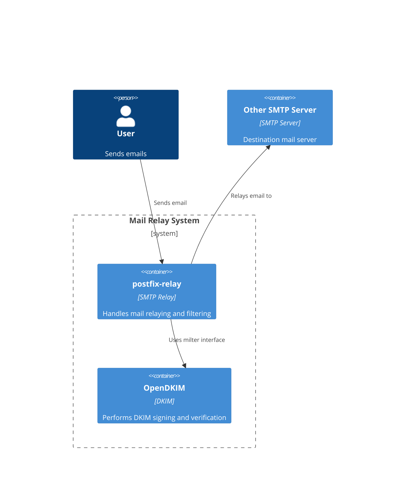

# Charm architecture

At its core, the OpenDKIM charm is an operator for managing OpenDKIM that provides the  milter relation for providing DKIM service.

The OpenDKIM charm is a machine charm that manages the OpenDKIM package. The OpenDKIM charm follows a holistic approach, calling
a main reconcile method for the Juju events not related to installing the OpenDKIM package.

## High-level overview of OpenDKIM deployment

The following diagram shows a typical deployment of the OpenDKIM charm.

The OpenDKIM charm provides DKIM signing and validation for other charms, and will integrate with charms like `postfix-relay`.

## Metrics

<!--
If the charm uses metrics, include a list under reference/metrics.md and link that document here.
If the charm uses containers, you may include text here like:

Inside the above mentioned containers, additional Pebble layers are defined in order to provide metrics.
See [metrics](../explanation/link-to-metrics-document) for more information.
-->

## Juju events

For this charm, the following Juju events are observed:

1. `install` and `upgrade_charm` install OpenDKIM.
2. `config_changed` and `secret_changed` call reconcile for the charm.
3. For the milter relation, `relation_changed` and `relation_departed` call reconcile for the charm.

> See more in the Juju docs: [Hook](https://documentation.ubuntu.com/juju/latest/user/reference/hook/)

## Charm code overview

The `src/charm.py` is the default entry point for a charm and has the OpenDKIMCharm Python class which inherits
from CharmBase. CharmBase is the base class from which all charms are formed, defined
by [Ops](https://ops.readthedocs.io/en/latest/index.html) (Python framework for developing charms).

> See more in the Juju docs: [Charm](https://documentation.ubuntu.com/juju/latest/user/reference/charm/)

The `__init__` method guarantees that the charm observes all events relevant to its operation and handles them.
